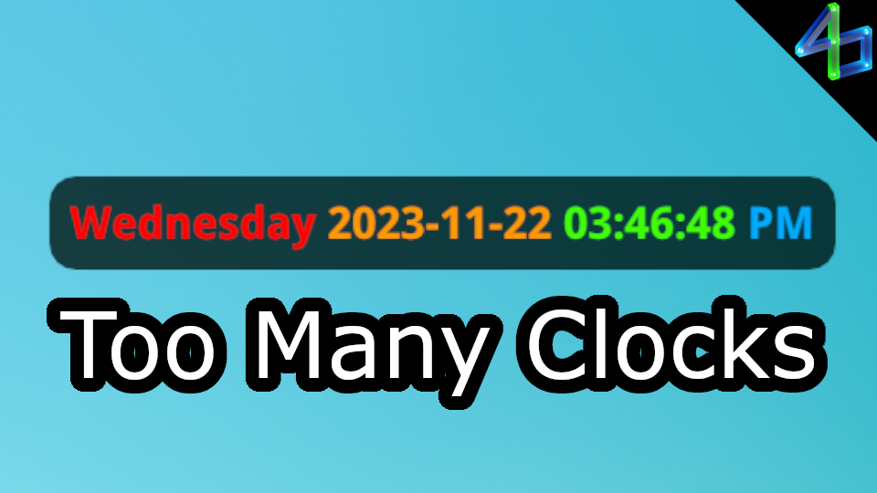

# Too Many Clocks

Have you wanted to know what time it is but don't want to tab out of the game? Are you unhappy with the current timekeeping offerings? If so, this plugin is for you! Currently there is only a single digital clock, but there are plans to include an analog one, a hybrid one, and the option to show multiple clocks for different timezones.

The name, "Too Many Clocks" is an homage to the classic Adult Swim video from 2014 named [Too Many Cooks](https://youtu.be/QrGrOK8oZG8).\
The term, "Too Many Cooks" comes from the old proverb, "too many cooks spoil the broth," meaning when there are too many people involved in a project, the result may be worse than if there were fewer. However for a plugin like this, I think more options makes for a better experience!

